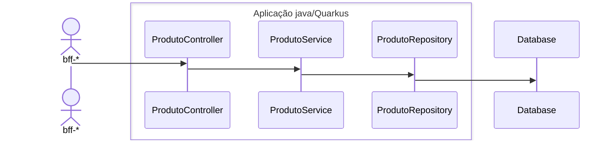
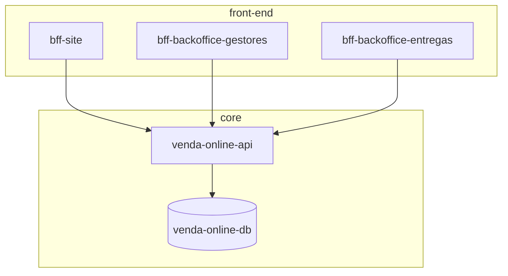
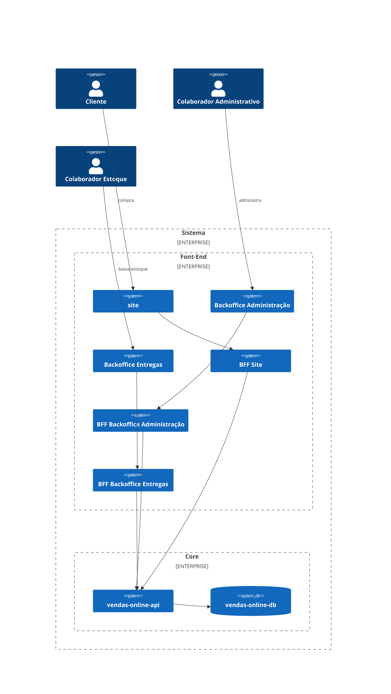

# Desafio Final Bootcamp Arquiteto(a) de Software

## Link repositorio com implementação: https://github.com/adriano-moreira/2025-xpe-pos-arquitetura-de-software-desafio-final

Implementacão utilizando:
- Java 21 (LTS atual em fevereiro 2025)
- Quarkus 3.15.3 (LTS atual em fevereiro 2025)


# Vendas-online-api

repo: https


## Estrutura de pasta
```
└── api
    ├── controller
    │   └── ProdutoController.java
    ├── model
    │   └── ProdutoEntity.java
    ├── repository
    │   └── ProdutoRepository.java
    └── service
        └── ProdutoService.java
```

## Diagrama de sequencia, apresentado o fluxo entre as classes para endpoints de Produto 


## Diagrama de fluxo



## C4 Component Diagram

